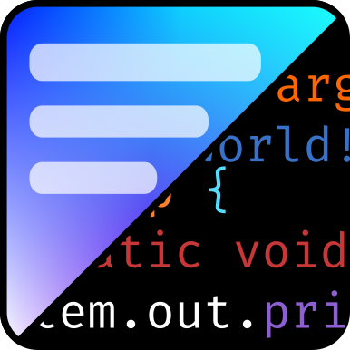

<a name="readme-top"></a>

[![Contributors][contributors-shield]][contributors-url]
[![Forks][forks-shield]][forks-url]
[![Stargazers][stars-shield]][stars-url]
[![Issues][issues-shield]][issues-url]
[![MIT License][license-shield]][license-url]

<br />
<div align="center">
  <a href="https://github.com/HyScript7/ProCM">
    
  </a>

<h3 align="center">ProCM</h3>

  <p align="center">
    A blog & portfolio content management web application
    <br />
    <a href="https://github.com/HyScript7/ProCM"><strong>Explore the docs »</strong></a>
    <br />
    <br />
    <a href="https://github.com/HyScript7/ProCM">View Demo</a>
    ·
    <a href="https://github.com/HyScript7/ProCM/issues">Report Bug</a>
    ·
    <a href="https://github.com/HyScript7/ProCM/issues">Request Feature</a>
  </p>
</div>

<details>
  <summary>Table of Contents</summary>
  <ol>
    <li>
      <a href="#about-the-project">About The Project</a>
      <ul>
        <li><a href="#built-with">Built With</a></li>
      </ul>
    </li>
    <li>
      <a href="#getting-started">Getting Started</a>
      <ul>
        <li><a href="#prerequisites">Prerequisites</a></li>
        <li><a href="#installation">Installation</a></li>
      </ul>
    </li>
    <li><a href="#usage">Usage</a></li>
    <li><a href="#roadmap">Roadmap</a></li>
    <li><a href="#contributing">Contributing</a></li>
    <li><a href="#license">License</a></li>
    <li><a href="#contact">Contact</a></li>
    <li><a href="#acknowledgments">Acknowledgments</a></li>
  </ol>
</details>

## About The Project

[![PortCM][product-screenshot]](https://procm-blog.onrender.com/)

ProCM is a robust web application serving as a platform for blogging. With user-friendly authentication and comment system, visitors can engage in lively discussions through comments on blog posts. Users have the added functionality of personalizing their profiles with an "About me" section, while administrators have access to an administration UI to manage the website.

<p align="right">(<a href="#readme-top">back to top</a>)</p>

### Built With

- [![Gradle][Gradle]][Gradle-url]
- [![Java 17][Java]][Java-url]
- [![Spring.io][Spring]][Spring-url]
- [![Postgres][Postgres]][Postgres-url]
- [![htmx][HTMX]][HTMX-url]
- [![Tailwind][TailwindCSS]][TailwindCSS-url]
- [![DaisyUI][DaisyUI]][DaisyUI-url]

<p align="right">(<a href="#readme-top">back to top</a>)</p>

## Getting Started

This is an example of how you may give instructions on setting up your project locally.
To get a local copy up and running follow these simple example steps.

### Prerequisites

In order to build and run the project you must have a JDK (Java 17) and Gradle installed.

- [![jre][Java]][jre-url]
- [![gradle][Gradle]][Gradle-url]

### Installation

1. Get a local database for testing (you can use the `docker-compose.yml` file in the backend)
2. Clone the repo
   ```sh
   git clone https://github.com/HyScript7/ProCM.git
   ```
3. Run or build the project
  ```sh
  gradle bootrun # run spring app
  gradle bootjar # compile to jar
  ```

<p align="right">(<a href="#readme-top">back to top</a>)</p>

## Usage

Use this space to show useful examples of how a project can be used. Additional screenshots, code examples and demos work well in this space. You may also link to more resources.

_For more examples, please refer to the [Documentation](https://example.com)_

<p align="right">(<a href="#readme-top">back to top</a>)</p>

## Roadmap

- [ ] Feature 1
- [ ] Feature 2
- [ ] Feature 3
  - [ ] Nested Feature

See the [open issues](https://github.com/HyScript7/ProCM/issues) for a full list of proposed features (and known issues).

<p align="right">(<a href="#readme-top">back to top</a>)</p>

## Contributing

Contributions are what make the open source community such an amazing place to learn, inspire, and create. Any contributions you make are **greatly appreciated**.

If you have a suggestion that would make this better, please fork the repo and create a pull request. You can also simply open an issue with the tag "enhancement".
Don't forget to give the project a star! Thanks again!

1. Fork the Project
2. Create your Feature Branch (`git checkout -b feature/AmazingFeature`)
3. Commit your Changes (`git commit -m 'Add some AmazingFeature'`)
4. Push to the Branch (`git push origin feature/AmazingFeature`)
5. Open a Pull Request

<p align="right">(<a href="#readme-top">back to top</a>)</p>

## License

Distributed under the MIT License. See `LICENSE.txt` for more information.

<p align="right">(<a href="#readme-top">back to top</a>)</p>

## Contact

HyScript7 - [@hyscript7](https://twitter.com/hyscript7) - hyscript7@gmail.com

Project Link: [https://github.com/HyScript7/ProCM](https://github.com/HyScript7/ProCM)

<p align="right">(<a href="#readme-top">back to top</a>)</p>

## Acknowledgments

- [Best README Template](https://github.com/othneildrew/Best-README-Template/)

<p align="right">(<a href="#readme-top">back to top</a>)</p>

[contributors-shield]: https://img.shields.io/github/contributors/HyScript7/ProCM.svg?style=for-the-badge
[contributors-url]: https://github.com/HyScript7/ProCM/graphs/contributors
[forks-shield]: https://img.shields.io/github/forks/HyScript7/ProCM.svg?style=for-the-badge
[forks-url]: https://github.com/HyScript7/ProCM/network/members
[stars-shield]: https://img.shields.io/github/stars/HyScript7/ProCM.svg?style=for-the-badge
[stars-url]: https://github.com/HyScript7/ProCM/stargazers
[issues-shield]: https://img.shields.io/github/issues/HyScript7/ProCM.svg?style=for-the-badge
[issues-url]: https://github.com/HyScript7/ProCM/issues
[license-shield]: https://img.shields.io/github/license/HyScript7/ProCM.svg?style=for-the-badge
[license-url]: https://github.com/HyScript7/ProCM/blob/master/LICENSE.txt
[linkedin-shield]: https://img.shields.io/badge/-LinkedIn-black.svg?style=for-the-badge&logo=linkedin&colorB=555
[linkedin-url]: https://linkedin.com/in/linkedin_username
[product-screenshot]: images/screenshot.png
[Spring]: https://img.shields.io/badge/spring-%236DB33F.svg?style=for-the-badge&logo=spring&logoColor=white
[Spring-url]: https://spring.io/
[Java]: https://img.shields.io/badge/java-%23ED8B00.svg?style=for-the-badge&logo=openjdk&logoColor=white
[Java-url]: https://www.java.com/en/
[Postgres]: https://img.shields.io/badge/postgres-%23316192.svg?style=for-the-badge&logo=postgresql&logoColor=white
[Postgres-url]: https://www.postgresql.org/
[HTMX]: https://img.shields.io/badge/htmx-%233A67DE.svg?style=for-the-badge&logo=htmx&logoColor=white
[HTMX-url]: https://htmx.org/
[TailwindCSS]: https://img.shields.io/badge/tailwindcss-%2338B2AC.svg?style=for-the-badge&logo=tailwind-css&logoColor=white
[TailwindCSS-url]: https://tailwindcss.com/
[DaisyUI]: https://img.shields.io/badge/daisyui-5A0EF8?style=for-the-badge&logo=daisyui&logoColor=white
[DaisyUI-url]: https://daisyui.com/
[Gradle]: https://img.shields.io/badge/Gradle-02303A.svg?style=for-the-badge&logo=Gradle&logoColor=white
[Gradle-url]: https://gradle.org/
[pnpm]: https://img.shields.io/badge/pnpm-%234a4a4a.svg?style=for-the-badge&logo=pnpm&logoColor=f69220
[pnpm-url]: https://pnpm.io/
[npm]: https://img.shields.io/badge/NPM-%23CB3837.svg?style=for-the-badge&logo=npm&logoColor=white
[npm-url]: https://www.npmjs.com/
[jre-url]: https://adoptium.net/temurin/releases/
